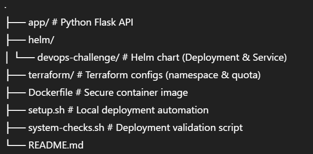
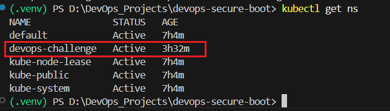
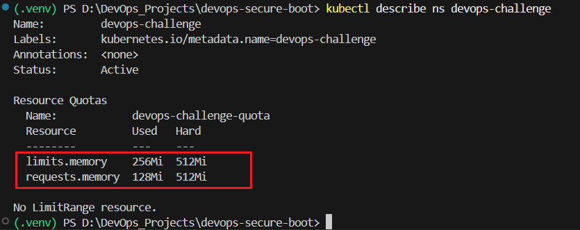
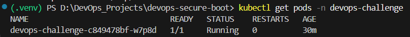
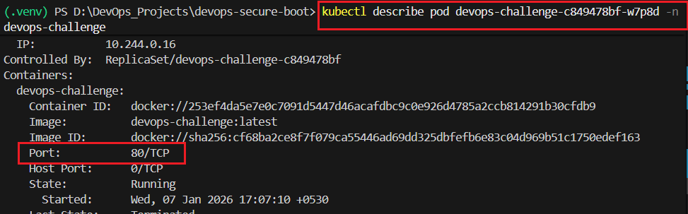
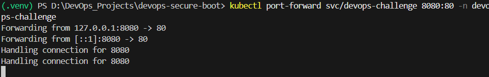
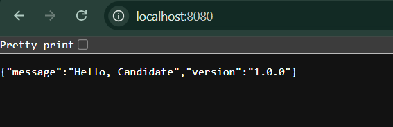

# DevOps Challenge – Secure Application Deployment

## End-to-End Application Workflow

This repository contains my solution to the DevOps Challenge.  
The project demonstrates secure containerization, Kubernetes deployment using Helm, infrastructure provisioning with Terraform, CI validation using GitHub Actions, and local automation using shell scripts.
The project starts with a simple Python Flask application that exposes a REST API on port 80. The application is containerized using a secure Dockerfile that creates and runs the process as a non-root user while still allowing it to bind to port 80 using Linux capabilities. This Docker image is then built locally and, depending on the environment, either loaded into Minikube for local development or pushed to a container registry for environments that require image pulling. Infrastructure resources such as the Kubernetes namespace and resource quota are provisioned using Terraform, ensuring that the application runs within defined limits. The application itself is deployed using a Helm chart that defines the Kubernetes Deployment and Service, along with security context configurations like a read-only root filesystem.

The CI pipeline, implemented using GitHub Actions, validates the entire workflow on every push. It checks out the code, lints the Python application, validates the Helm chart, verifies Terraform syntax, and ensures the Docker image can be built successfully. Once deployed, the application runs inside Kubernetes as a non-root container listening on port 80 and is validated using a script that confirms the runtime user, port configuration, and API response. The application is accessed using Kubernetes port-forwarding, which allows safe local verification without exposing the service publicly, completing a secure and production-aligned DevOps workflow.


---

## Prerequisites

The following tools are required to run this solution locally:

### Required Tools
- Docker
  - Used to build and run the application container
  - Docker Desktop (Windows/macOS) or Docker Engine (Linux)
    
- Minikube (Docker driver)
  - Local cluster using Minikube (Docker driver recommended)
  - At least 2 CPU cores available for Minikube
    
- kubectl
  - Kubernetes command-line tool
  - Configured to communicate with the local cluster
    
- Helm (v3 or later)
  - Used to deploy the application (Deployment & Service)
    
- Terraform
  - Used to provision a Kubernetes namespace and resource quota
    
- Git
  - Required to clone the repository
    
- Bash-compatible shell (Linux / macOS / WSL / Ubuntu VM)
  - Required to execute setup.sh and system-checks.sh
  - Linux, macOS, or WSL (Windows Subsystem for Linux)


> **Note:**  
> Minikube requires a minimum of **2 CPU cores**. Some sandbox environments (such as certain Killercoda labs) may not support Minikube due to resource limitations.

---

## Repository Structure



---

# Execution of Project locally
## Clone the repository
```
git clone https://github.com/Gaurii-01/devops-challenge.git
```
cd into the repo directory
```
cd devops-challenge
```
## Using `setup.sh`

The `setup.sh` script automates the full local deployment workflow.

### What the script does
1. Builds the Docker image locally
2. Loads the image into Minikube if Minikube is detected
3. Initializes and applies Terraform configuration
4. Installs or upgrades the Helm release
5. Stops execution immediately if any step fails

### Run the script

```bash
chmod +x setup.sh                 # Execute permission to the script file
./setup.sh
```
Expected Result
```
Kubernetes namespace devops-challenge is created
Application pod reaches Running state
```







## Port 80 & Non-Root User – Solution Explanation

### Problem

Linux restricts binding to ports below 1024 for non-root users

The application must:

- Run as a non-root user

- Bind to port 80

### Solution

Linux capabilities were used to grant only the required privilege.

In the Dockerfile:
```
RUN setcap 'cap_net_bind_service=+ep' /usr/local/bin/python3.11
USER appuser
```
### Why this works

- CAP_NET_BIND_SERVICE allows binding to privileged ports

- The application runs without root privileges

- No escalation to root is required at runtime

This approach follows the principle of least privilege and is production-safe.


## Validation Using system-checks.sh

The system-checks.sh script verifies the deployment.


What it validates

- The container runs as a non-root user

- The application is configured to run on port 80

- The API returns the expected JSON response

Run the script
```
chmod +x system-checks.sh         # Execute permission to script file
./system-checks.sh
```
Expected Output
```
UID is not 0

Port 80 is confirmed
```
API response:
```
{"message": "Hello, Candidate", "version": "1.0.0"}
```










